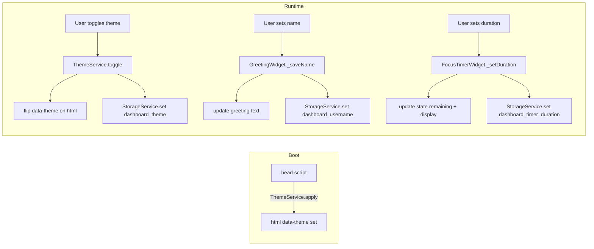

# Design Document — Dashboard Enhancements

## Overview

This document covers the technical design for three incremental enhancements to the existing personal dashboard:

1. **Light/Dark mode toggle** — a persistent theme switcher applied via a `[data-theme]` attribute on `<html>`
2. **Custom name in greeting** — a name input inside the greeting widget that personalises the greeting message
3. **Configurable Pomodoro duration** — a duration input inside the focus timer widget that replaces the hard-coded 25-minute default

All changes are confined to the existing three files (`index.html`, `css/style.css`, `js/app.js`). No new dependencies, no build tools.

---

## Architecture

The existing module pattern is preserved. Each enhancement extends the relevant existing module:

```
js/app.js
  ├── StorageService          — unchanged API; three new storage keys
  ├── ThemeService  (new)     — reads/writes theme, applies [data-theme] to <html>
  ├── GreetingWidget          — extended: name input, personalised greeting
  ├── FocusTimerWidget        — extended: duration input, configurable start value
  ├── TodoWidget              — unchanged
  └── QuickLinksWidget        — unchanged
```

Theme application happens as early as possible — `ThemeService.apply()` is called synchronously from a `<script>` block in `<head>` (before any paint) so there is no flash of the wrong theme.



---

## Components and Interfaces

### ThemeService (new)

A small module responsible for all theme logic. Keeps theme state out of the DOM query path.

```js
ThemeService = {
  STORAGE_KEY: 'dashboard_theme',
  DEFAULT: 'dark',

  // Read stored theme (or default) and set data-theme on <html>
  apply(),

  // Flip the current theme and persist
  toggle(),

  // Return the currently active theme string ('light' | 'dark')
  current(),
}
```

`apply()` is called twice: once inline in `<head>` (no DOM needed — only touches `document.documentElement`) and once in `DOMContentLoaded` to update the toggle button label.

### GreetingWidget — extensions

Two new responsibilities added to the existing widget:

| Addition | Detail |
|---|---|
| `_name` state | String loaded from `StorageService` on init; empty string if absent |
| `_elNameInput` | Reference to the new `<input>` inside the greeting section |
| `_saveName(value)` | Trims, validates non-empty, persists, re-renders greeting |
| `_buildGreeting(hour)` | Returns `"Good morning, Alex"` when name is set, `"Good morning"` when not |

The existing `_tick()` method calls `_buildGreeting(hour)` instead of `getGreeting(hour)` directly.

### FocusTimerWidget — extensions

Two new responsibilities added to the existing widget:

| Addition | Detail |
|---|---|
| `state.duration` | Minutes (integer 1–60); loaded from storage on init; default 25 |
| `_elDurationInput` | Reference to the new `<input type="number">` inside the timer section |
| `_setDuration(value)` | Validates range, updates `state.duration` and `state.remaining`, persists, re-renders |
| `_reset()` (modified) | Resets to `state.duration * 60` instead of hard-coded 1500 |
| `_start()` / `_stop()` (modified) | Enable/disable `_elDurationInput` alongside existing button logic |

---

## Data Models

### New localStorage keys

| Key | Type | Default | Description |
|---|---|---|---|
| `dashboard_theme` | `"light"` \| `"dark"` | `"dark"` | Active colour theme |
| `dashboard_username` | `string` | `""` (absent) | User's display name |
| `dashboard_timer_duration` | `number` (integer 1–60) | `25` | Timer duration in minutes |

### Theme representation

The theme is stored as a plain string. The CSS uses a `[data-theme="light"]` attribute selector on `<html>` to override the dark-mode custom properties. Dark is the default (`:root` rules), so no attribute is needed for dark mode — only `data-theme="light"` needs to be set/removed.

```js
// Applying light theme
document.documentElement.setAttribute('data-theme', 'light');

// Reverting to dark theme
document.documentElement.removeAttribute('data-theme');
// or setAttribute('data-theme', 'dark') — both work
```

### Timer state (extended)

```js
state: {
  remaining: number,  // seconds remaining (0 – duration*60)
  running:   boolean,
  duration:  number,  // minutes (1–60), persisted
}
```

---

## Correctness Properties

*A property is a characteristic or behavior that should hold true across all valid executions of a system — essentially, a formal statement about what the system should do. Properties serve as the bridge between human-readable specifications and machine-verifiable correctness guarantees.*

### Property 1: Theme toggle is an involution

*For any* active theme state, toggling the theme twice SHALL return the dashboard to the original theme (i.e. `toggle(toggle(theme)) === theme`).

**Validates: Requirements 1.2**

---

### Property 2: Theme persistence round-trip

*For any* valid theme value (`"light"` or `"dark"`), after applying that theme, `StorageService.get("dashboard_theme")` SHALL return that same value.

**Validates: Requirements 1.5**

---

### Property 3: Valid name updates the greeting

*For any* non-empty, non-whitespace-only string used as a name, after saving it, the greeting message SHALL contain `", "` followed by the trimmed name.

**Validates: Requirements 2.2, 2.7**

---

### Property 4: Whitespace-only name is rejected

*For any* string composed entirely of whitespace characters, attempting to save it as the user name SHALL leave the greeting message unchanged.

**Validates: Requirements 2.3**

---

### Property 5: Name persistence round-trip

*For any* valid (non-empty, non-whitespace) name string, after saving it, `StorageService.get("dashboard_username")` SHALL return the trimmed name.

**Validates: Requirements 2.4**

---

### Property 6: Valid duration updates display and state

*For any* integer `d` in the range [1, 60], after setting the timer duration to `d`, the timer display SHALL show `formatTime(d * 60)` and `state.remaining` SHALL equal `d * 60`.

**Validates: Requirements 3.2**

---

### Property 7: Invalid duration is rejected

*For any* value outside the integer range [1, 60] (including 0, 61, negative numbers, non-numeric strings, and decimals), attempting to set the timer duration SHALL leave `state.duration` and `state.remaining` unchanged.

**Validates: Requirements 3.3**

---

### Property 8: Reset restores configured duration

*For any* integer `d` in the range [1, 60], after setting the duration to `d` and then activating reset, `state.remaining` SHALL equal `d * 60` and the display SHALL show `formatTime(d * 60)`.

**Validates: Requirements 3.5**

---

### Property 9: Duration persistence round-trip

*For any* integer `d` in the range [1, 60], after setting the timer duration to `d`, `StorageService.get("dashboard_timer_duration")` SHALL return `d`.

**Validates: Requirements 3.6**

---

**Property Reflection:**

- Properties 6 and 8 both involve setting a duration and checking `state.remaining`. They are not redundant: Property 6 checks the immediate effect of setting a duration; Property 8 checks that reset uses the configured duration rather than the hard-coded 1500. Both are retained.
- Properties 3 and 5 both involve valid names. Property 3 checks the DOM output; Property 5 checks storage. They validate different layers and are both retained.
- Properties 2 and 9 are both persistence round-trips for different keys. Both retained as they test different modules.

---

## Error Handling

| Scenario | Handling |
|---|---|
| `localStorage` unavailable | Existing `StorageService` try/catch handles this; app continues in-memory with defaults |
| Theme value in storage is unrecognised | `ThemeService.apply()` falls back to `"dark"` if stored value is not `"light"` |
| Name input submitted while timer is running | Name input is independent of timer state; no restriction needed |
| Duration input submitted while timer is running | `_elDurationInput` is disabled while `state.running === true`; change is silently ignored |
| Duration value is a float (e.g. `1.5`) | `Math.round` or `parseInt` used during validation; non-integer treated as invalid |
| Duration input cleared/empty | Empty string fails numeric validation; current duration retained |

---

## Testing Strategy

### Unit / Example-based tests

Concrete scenarios and edge cases:

- `ThemeService.apply()` with `"light"` in storage sets `data-theme="light"` on `<html>`
- `ThemeService.apply()` with no stored value leaves `data-theme` absent (dark default)
- `ThemeService.toggle()` from dark → light → dark (two-step example)
- `GreetingWidget` with stored name `"Alex"` renders `"Good morning, Alex"`
- `GreetingWidget` with no stored name renders `"Good morning"` (no comma)
- `FocusTimerWidget` with stored duration `10` initialises `state.remaining` to `600`
- `FocusTimerWidget` with no stored duration initialises `state.remaining` to `1500`
- Duration input is disabled when timer is running; re-enabled after stop/reset
- Setting duration to `0` or `61` does not change `state.duration`

### Property-based tests

Use **fast-check** (JavaScript) with a minimum of **100 iterations per property**.

Each test is tagged with the property it validates:

| Tag format | `Feature: dashboard-enhancements, Property N: <property text>` |
|---|---|

Properties to implement as PBT tests:

| # | Generator | Assertion |
|---|---|---|
| 1 | `fc.constantFrom('light', 'dark')` | toggle twice returns original |
| 2 | `fc.constantFrom('light', 'dark')` | storage contains applied theme |
| 3 | `fc.string({ minLength: 1 }).filter(s => s.trim().length > 0)` | greeting contains trimmed name |
| 4 | `fc.stringOf(fc.constantFrom(' ', '\t', '\n'))` | greeting unchanged after whitespace submit |
| 5 | `fc.string({ minLength: 1 }).filter(s => s.trim().length > 0)` | storage contains trimmed name |
| 6 | `fc.integer({ min: 1, max: 60 })` | display = `formatTime(d*60)`, remaining = `d*60` |
| 7 | `fc.oneof(fc.integer({ max: 0 }), fc.integer({ min: 61 }), fc.string())` | duration unchanged |
| 8 | `fc.integer({ min: 1, max: 60 })` | after set + reset, remaining = `d*60` |
| 9 | `fc.integer({ min: 1, max: 60 })` | storage contains set duration |

### Integration / smoke tests

- Page loads without JS errors; all four widgets render
- Theme applied before first paint (no flash): verify `data-theme` is set synchronously in `<head>` script
- Stored name survives page reload
- Stored theme survives page reload
- Stored duration survives page reload
- Responsive layout unaffected by new controls at 768 px breakpoint
