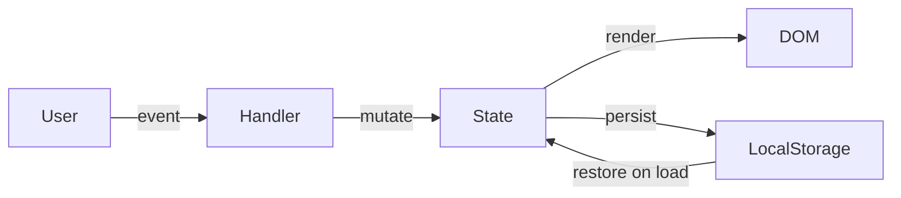

# Design Document

## Overview

The personal dashboard is a single-page web application (SPA) built with plain HTML, CSS, and vanilla JavaScript — no build tools, no frameworks, no backend. Everything runs in the browser. Four widgets live on one page: a Greeting Widget, a Focus Timer, a To-Do List, and a Quick Links panel. All user data is persisted via `localStorage`.

The entire app ships as three files:
- `index.html` — structure and widget markup
- `css/style.css` — all styles and responsive layout
- `js/app.js` — all behaviour, state management, and storage

---

## Architecture

The app follows a **module pattern** inside a single JS file. Each widget is an isolated module with its own state, DOM references, and `localStorage` key. A thin `init()` call on `DOMContentLoaded` bootstraps all four modules.

```
index.html
  └── <link> css/style.css
  └── <script> js/app.js
        ├── StorageService       — thin wrapper around localStorage
        ├── GreetingWidget       — time/date/greeting display
        ├── FocusTimerWidget     — countdown timer logic
        ├── TodoWidget           — task CRUD + persistence
        └── QuickLinksWidget     — link CRUD + persistence
```

Data flow is unidirectional: user interaction → widget handler → update in-memory state → re-render DOM → persist to `localStorage`. There is no shared state between widgets.



---

## Components and Interfaces

### StorageService

A thin wrapper so widgets never call `localStorage` directly.

```js
StorageService.get(key)          // returns parsed JSON or null
StorageService.set(key, value)   // serialises to JSON and saves
```

### GreetingWidget

Owns a `setInterval` that fires every 1000 ms and updates the DOM.

| Responsibility | Detail |
|---|---|
| Display time | `HH:MM` format, updated every second |
| Display date | e.g. "Monday, July 14 2025" |
| Display greeting | Derived from current hour (see data model) |

No persistent state — purely derived from `Date`.

### FocusTimerWidget

Manages a single countdown interval.

| Responsibility | Detail |
|---|---|
| State | `{ remaining: 1500, running: false }` |
| Start | Creates interval, disables start button |
| Stop | Clears interval, enables start button |
| Reset | Clears interval, sets remaining to 1500 |
| Tick | Decrements remaining; auto-stops at 0 |
| Display | Formats remaining as `MM:SS` |

Timer state is **not** persisted to `localStorage` — it resets on page reload by design (no requirement for persistence).

### TodoWidget

Manages an array of task objects.

| Responsibility | Detail |
|---|---|
| Add | Validates non-empty input, appends task, persists |
| Edit | Inline edit mode per task, validates on save |
| Toggle | Flips `completed` flag, persists |
| Delete | Removes task by id, persists |
| Restore | Loads from `localStorage` on init |
| Render | Full re-render of task list on every state change |

Storage key: `"dashboard_todos"`

### QuickLinksWidget

Manages an array of link objects.

| Responsibility | Detail |
|---|---|
| Add | Validates non-empty label + URL, appends link, persists |
| Delete | Removes link by id, persists |
| Navigate | Opens URL in new tab |
| Restore | Loads from `localStorage` on init |
| Render | Full re-render of links panel on every state change |

Storage key: `"dashboard_links"`

---

## Data Models

### Task

```js
{
  id: string,          // crypto.randomUUID() or Date.now().toString()
  description: string, // non-empty, trimmed
  completed: boolean   // false on creation
}
```

### Link

```js
{
  id: string,   // crypto.randomUUID() or Date.now().toString()
  label: string, // non-empty, trimmed
  url: string    // non-empty, trimmed
}
```

### Greeting mapping

```js
const GREETINGS = [
  { start:  5, end: 11, message: "Good morning"   },
  { start: 12, end: 17, message: "Good afternoon" },
  { start: 18, end: 21, message: "Good evening"   },
  // 22–23 and 0–4 → "Good night"
];
```

### localStorage schema

| Key | Value |
|---|---|
| `dashboard_todos` | `Task[]` serialised as JSON |
| `dashboard_links` | `Link[]` serialised as JSON |

---

## Correctness Properties

*A property is a characteristic or behavior that should hold true across all valid executions of a system — essentially, a formal statement about what the system should do. Properties serve as the bridge between human-readable specifications and machine-verifiable correctness guarantees.*

### Property 1: Greeting is always defined

*For any* local time (any hour 0–23), the greeting function SHALL return exactly one of "Good morning", "Good afternoon", "Good evening", or "Good night" — never `undefined` or an empty string.

**Validates: Requirements 1.3, 1.4, 1.5, 1.6**

---

### Property 2: Timer display format invariant

*For any* remaining time value between 0 and 1500 seconds (inclusive), the `formatTime` function SHALL return a string matching the pattern `MM:SS` where MM is zero-padded minutes and SS is zero-padded seconds.

**Validates: Requirements 2.3**

---

### Property 3: Task addition round-trip

*For any* non-empty, non-whitespace task description, adding it to the todo list and then reading from `localStorage` SHALL produce a task list that contains an entry with that exact (trimmed) description and `completed: false`.

**Validates: Requirements 3.2, 3.5, 3.6**

---

### Property 4: Whitespace task rejection

*For any* string composed entirely of whitespace characters, attempting to add it as a task SHALL leave the task list unchanged (same length, same contents).

**Validates: Requirements 3.3**

---

### Property 5: Task completion toggle is an involution

*For any* task, toggling its completion state twice SHALL return the task to its original completion state.

**Validates: Requirements 5.1**

---

### Property 6: Task edit round-trip

*For any* task and any non-empty, non-whitespace replacement description, confirming an edit SHALL update the task's description to the trimmed replacement value while leaving all other task fields unchanged.

**Validates: Requirements 4.2**

---

### Property 7: Link addition round-trip

*For any* non-empty label and non-empty URL, adding a link and then reading from `localStorage` SHALL produce a link list that contains an entry with that exact (trimmed) label and URL.

**Validates: Requirements 7.2, 7.6**

---

### Property 8: Link/task deletion removes exactly one item

*For any* list of tasks (or links) with at least one item, deleting an item by its id SHALL reduce the list length by exactly one and SHALL remove only the item with that id.

**Validates: Requirements 5.3, 7.5**

---

## Error Handling

| Scenario | Handling |
|---|---|
| `localStorage` unavailable (private mode, quota exceeded) | Wrap `StorageService.set` in try/catch; log warning to console; app continues in-memory |
| Empty/whitespace task input | Prevent creation, retain focus on input field |
| Empty label or URL for quick link | Prevent creation, no user-visible error needed beyond the add button doing nothing |
| Edit confirmed with empty value | Discard edit, restore original description |
| Edit cancelled (Escape) | Discard edit, restore original description |
| Timer already running (start pressed again) | Start button is disabled while running — not reachable |
| `crypto.randomUUID` unavailable (very old browser) | Fall back to `Date.now().toString() + Math.random()` for id generation |

---

## Testing Strategy

### Unit / Example-based tests

Focus on concrete scenarios and edge cases:

- Greeting function returns correct string for each hour boundary (0, 5, 12, 18, 22)
- `formatTime(0)` → `"00:00"`, `formatTime(1500)` → `"25:00"`, `formatTime(90)` → `"01:30"`
- Adding a task with only spaces does not grow the list
- Editing a task with an empty string restores the original description
- Adding a link with a missing URL does not grow the link list
- Timer auto-stops when remaining reaches 0

### Property-based tests

Use a property-based testing library (e.g., **fast-check** for JavaScript) with a minimum of **100 iterations per property**.

Each test is tagged with the property it validates:

| Tag format | `Feature: personal-dashboard, Property N: <property text>` |
|---|---|

Properties to implement as PBT tests:

1. `Feature: personal-dashboard, Property 1: Greeting is always defined` — generate random hour integers 0–23
2. `Feature: personal-dashboard, Property 2: Timer display format invariant` — generate random integers 0–1500
3. `Feature: personal-dashboard, Property 3: Task addition round-trip` — generate random non-empty strings
4. `Feature: personal-dashboard, Property 4: Whitespace task rejection` — generate strings of spaces/tabs/newlines
5. `Feature: personal-dashboard, Property 5: Task completion toggle is an involution` — generate random task objects
6. `Feature: personal-dashboard, Property 6: Task edit round-trip` — generate random task + replacement description pairs
7. `Feature: personal-dashboard, Property 7: Link addition round-trip` — generate random label + URL pairs
8. `Feature: personal-dashboard, Property 8: Link/task deletion removes exactly one item` — generate random lists with random target id

### Integration / smoke tests

- Page loads without JS errors in Chrome, Firefox, Edge, Safari
- All four widgets render on load
- `localStorage` data survives a page reload (manual or automated with Playwright)
- Responsive layout switches at 768 px breakpoint (visual check or Playwright viewport test)
